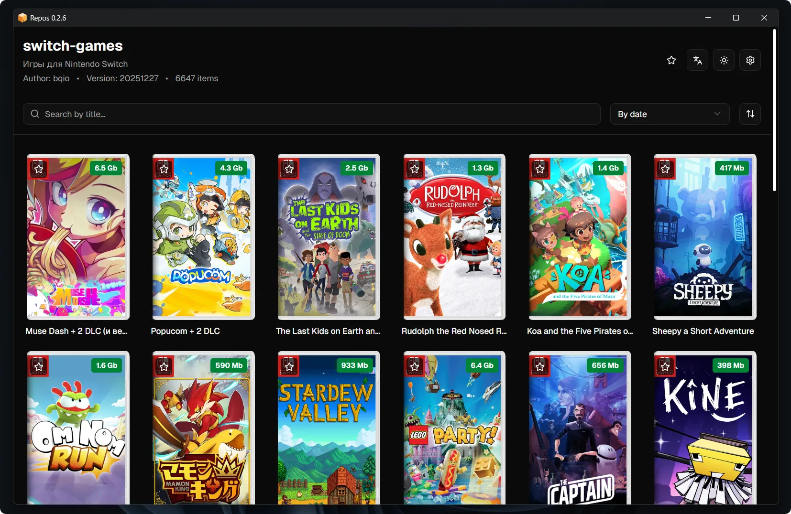

<div align="center">

<a href="https://repos-app.ru"></a>

# Repos

**Repository manager for your purpose.**

<a href="https://github.com/bqio/repos/releases"></a>



</div>

## Development

```bash
cargo tauri dev
```

## Build

```bash
cargo tauri build
```

## TODO

- Download torrent inside app

## FAQ

- [How to create a repository?](faq/REPO.md)

## License

MIT
